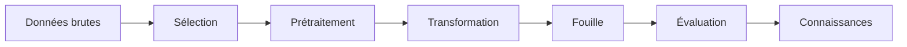

<h1 align="center">🧠 AI_data-mining_ML</h1>

<p align="center">
  Travaux dirigés du module <b>Intelligence Artificielle</b> — filière <b>Networking, Système et Cybersécurité</b><br>
  Faculté des Sciences Semlalia Marrakech · Université Cadi Ayyad
</p>

<p align="center">
  
  
  
</p>

---

## 📚 Travaux dirigés

| TD | Thème | Lien |
|:--:|-------|:----:|
| 01 | Processus KDD et préparation des données | [Voir](./TD1/README.md) |

*Les prochains TD seront ajoutés au fur et à mesure du semestre.*

---

## 🔄 Processus KDD



---

## 🗂️ Structure

```
AI_data-mining_ML/
├── README.md
└── TD1/
    └── README.md
```

---

## 👤 Auteur

**ItsHaname** — étudiante à la FSSM, Université Cadi Ayyad
